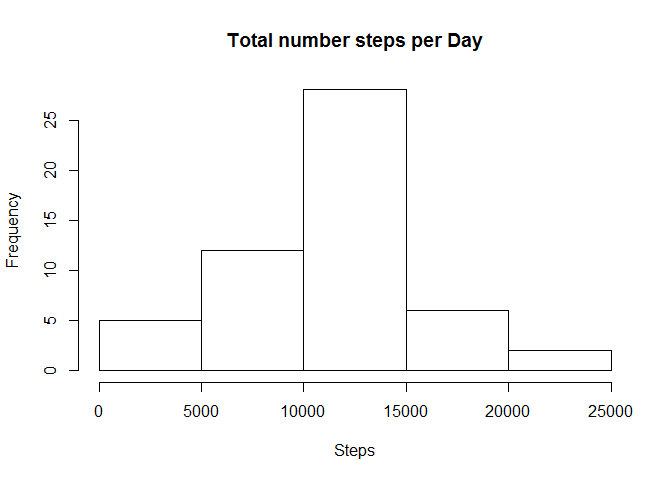
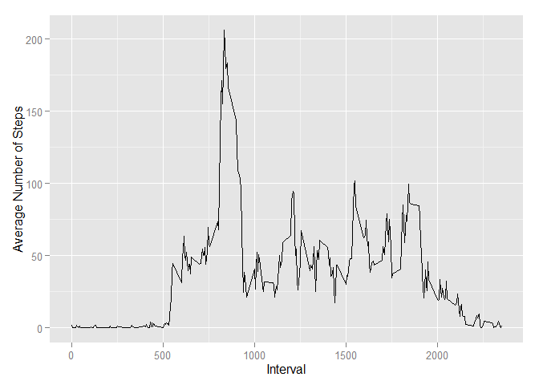
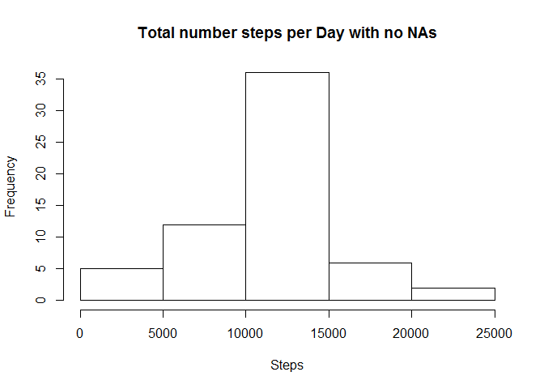
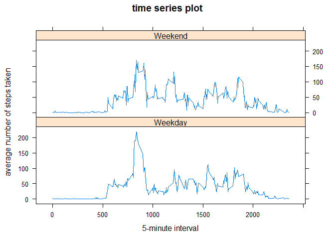

# Reproducible Research: Peer Assessment 1

## Load libraries        

```r
library(ggplot2)
library(plyr)
```

## Loading and preprocessing the data
#### 1. Load the data

```r
activity <- read.csv("activity.csv", header = TRUE, sep = ',', 
                     colClasses = c("numeric","character", "integer"))
```

#### 2. Process/transform the data into a format suitable for analysis

```r
activity$date<- as.POSIXct(activity$date, format="%Y-%m-%d",tz = "Europe/Andorra")
#Activities without no NAs
clean_activity <- activity[!is.na(activity$steps),]
```

```r
str(activity)
```

```
## 'data.frame':	17568 obs. of  3 variables:
##  $ steps   : num  NA NA NA NA NA NA NA NA NA NA ...
##  $ date    : POSIXct, format: "2012-10-01" "2012-10-01" ...
##  $ interval: int  0 5 10 15 20 25 30 35 40 45 ...
```

```r
str(clean_activity)
```

```
## 'data.frame':	15264 obs. of  3 variables:
##  $ steps   : num  0 0 0 0 0 0 0 0 0 0 ...
##  $ date    : POSIXct, format: "2012-10-02" "2012-10-02" ...
##  $ interval: int  0 5 10 15 20 25 30 35 40 45 ...
```

## What is mean total number of steps taken per day?

#### 1. Calculate the total number of steps taken per day

```r
Total_Steps_activity <-
        setNames(aggregate(activity$steps ~ activity$date, FUN = sum), c("Date", "Steps"))
head(Total_Steps_activity)
```

```
##         Date Steps
## 1 2012-10-02   126
## 2 2012-10-03 11352
## 3 2012-10-04 12116
## 4 2012-10-05 13294
## 5 2012-10-06 15420
## 6 2012-10-07 11015
```
####2. Histogram of the total number of steps taken each day

```r
hist(Total_Steps_activity$Steps,  xlab = "Steps", main = "Total number steps per Day")
```

\


####3. Calculate and report the mean and median of the total number of steps taken per day

```r
#Mean of Steps
as.integer(mean(Total_Steps_activity$Steps, na.rm = TRUE))
```

```
## [1] 10766
```

```r
#Median  of Steps
as.integer(median(Total_Steps_activity$Steps, na.rm = TRUE))
```

```
## [1] 10765
```

## What is the average daily activity pattern?
####1. Make a time series plot (i.e. type = "l") of the 5-minute interval (x-axis) and the average number of steps taken, averaged across all days (y-axis)

```r
intervalTable <-
        ddply(clean_activity, .(interval), summarize, Avg = mean(steps))
        ggplot(intervalTable, aes(x = interval, y = Avg)) +  geom_line() +    xlab("Interval") + ylab("Average Number of Steps")
```

\


####2. Which 5-minute interval, on average across all the days in the dataset, contains the maximum number of steps?

```r
intervalTable[which.max(intervalTable$Avg),1]
```

```
## [1] 835
```

## Imputing missing values
####1. Calculate and report the total number of missing values in the dataset (i.e. the total number of rows with NAs)


```r
        nrow(activity[is.na(activity$steps),])
```

```
## [1] 2304
```
####2. Devise a strategy for filling in all of the missing values in the dataset. The strategy does not need to be sophisticated. For example, you could use the mean/median for that day, or the mean for that 5-minute interval, etc.

My strategy: Use the average for that day, that have NA 5-minute interval


```r
        average_interval <-
                tapply(activity$steps, activity$interval, mean, na.rm = TRUE,     simplify =
                TRUE)
```
####3. Create a new dataset that is equal to the original dataset but with the missing data filled in.

```r
        noNAs_activity <- activity
        nas <- is.na(noNAs_activity$steps)
        noNAs_activity$steps[nas] <-
                average_interval[as.character(noNAs_activity$interval[nas])]
        
        head(activity)
```

```
##   steps       date interval
## 1    NA 2012-10-01        0
## 2    NA 2012-10-01        5
## 3    NA 2012-10-01       10
## 4    NA 2012-10-01       15
## 5    NA 2012-10-01       20
## 6    NA 2012-10-01       25
```

```r
        head(noNAs_activity)
```

```
##       steps       date interval
## 1 1.7169811 2012-10-01        0
## 2 0.3396226 2012-10-01        5
## 3 0.1320755 2012-10-01       10
## 4 0.1509434 2012-10-01       15
## 5 0.0754717 2012-10-01       20
## 6 2.0943396 2012-10-01       25
```

```r
        head(average_interval)
```

```
##         0         5        10        15        20        25 
## 1.7169811 0.3396226 0.1320755 0.1509434 0.0754717 2.0943396
```

####4. Make a histogram of the total number of steps taken each day 


```r
        Total_Steps_noNAs_activity <-
                setNames(aggregate(noNAs_activity$steps ~ noNAs_activity$date, FUN = sum), c("Date", "Steps"))
                
                
                head(Total_Steps_noNAs_activity)
```

```
##         Date    Steps
## 1 2012-10-01 10766.19
## 2 2012-10-02   126.00
## 3 2012-10-03 11352.00
## 4 2012-10-04 12116.00
## 5 2012-10-05 13294.00
## 6 2012-10-06 15420.00
```

```r
                hist(Total_Steps_noNAs_activity$Steps,  xlab = "Steps", main = "Total number steps per Day with no NAs")  
```

\


####5. Calculate and report the mean and median total number of steps taken per day. 

```r
#Mean of Steps
as.integer(mean(Total_Steps_noNAs_activity$Steps, na.rm = TRUE))
```

```
## [1] 10766
```

```r
#Median  of Steps
as.integer(median(Total_Steps_noNAs_activity$Steps, na.rm = TRUE))
```

```
## [1] 10766
```
####6. Do these values differ from the estimates from the first part of the assignment? What is the impact of imputing missing data on the estimates of the total daily number of steps?
 Mean value is equal in both parts(10766). Median is different: 10765 and 10766
 The impact of imputing missing data is that both the mean and the median become equal to the same value: 10766.
 The overall shape of the distribution has not changed.

## Are there differences in activity patterns between weekdays and weekends?

```r
Sys.setlocale("LC_TIME", "English")
```

```
## [1] "English_United States.1252"
```

```r
noNAs_activity$day <- weekdays(as.Date(noNAs_activity$date))
head(noNAs_activity)
```

```
##       steps       date interval    day
## 1 1.7169811 2012-10-01        0 Sunday
## 2 0.3396226 2012-10-01        5 Sunday
## 3 0.1320755 2012-10-01       10 Sunday
## 4 0.1509434 2012-10-01       15 Sunday
## 5 0.0754717 2012-10-01       20 Sunday
## 6 2.0943396 2012-10-01       25 Sunday
```
####1. Create a new factor variable in the dataset with two levels – “weekday” and “weekend” indicating whether a given date is a weekday or weekend day.

```r
noNAs_activity$weektype <-
        ifelse(noNAs_activity$day %in% c("Saturday", "Sunday"), "Weekend", "Weekday")
head(noNAs_activity)
```

```
##       steps       date interval    day weektype
## 1 1.7169811 2012-10-01        0 Sunday  Weekend
## 2 0.3396226 2012-10-01        5 Sunday  Weekend
## 3 0.1320755 2012-10-01       10 Sunday  Weekend
## 4 0.1509434 2012-10-01       15 Sunday  Weekend
## 5 0.0754717 2012-10-01       20 Sunday  Weekend
## 6 2.0943396 2012-10-01       25 Sunday  Weekend
```

####2. Make a panel plot containing a time series plot (i.e. type = "l") of the 5-minute interval (x-axis) and the average number of steps taken, averaged across all weekday days or weekend days (y-axis). See the README file in the GitHub repository to see an example of what this plot should look like using simulated data.


```r
intervalTable_ <- ddply(noNAs_activity, .(interval, weektype), summarize, Avg = mean(steps))
head(intervalTable_)
```

```
##   interval weektype        Avg
## 1        0  Weekday 2.03602058
## 2        0  Weekend 0.89123196
## 3        5  Weekday 0.44768439
## 4        5  Weekend 0.05993341
## 5       10  Weekday 0.17409949
## 6       10  Weekend 0.02330744
```

```r
library(lattice) 
xyplot(Avg~interval|weektype, data=intervalTable_, type="l",   layout = c(1,2),
       main="time series plot", 
       ylab="average number of steps taken", xlab="5-minute interval")
```

\


There is difference in activity patterns between weekdays and weekends
  
